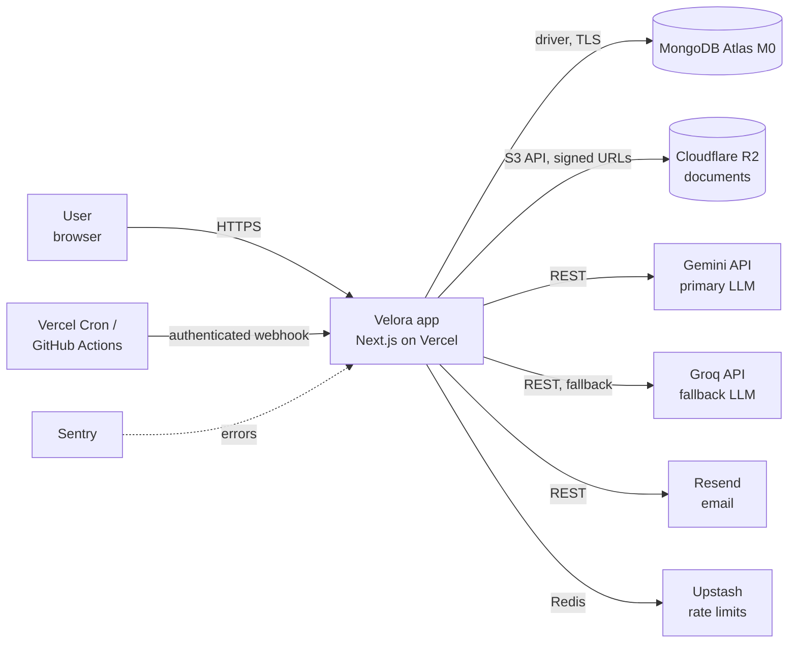
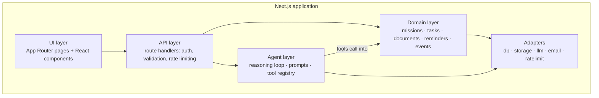
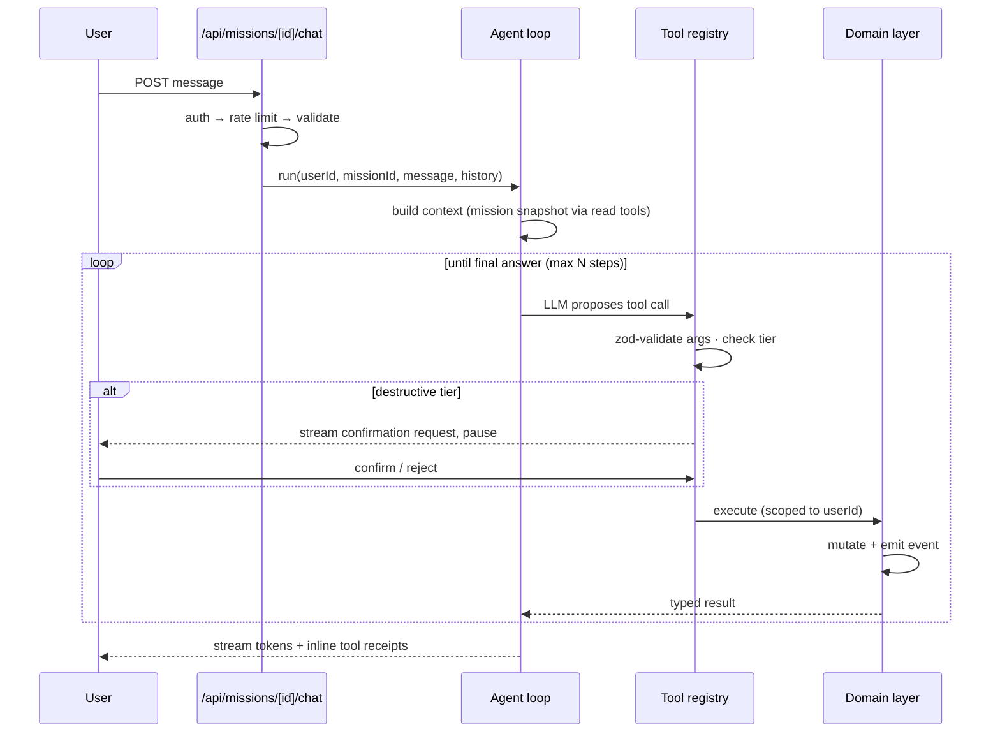

# Velora v2 — System Architecture

**Version:** 2.0-draft · **Date:** 2026-07-17
**Reads with:** 01-SRS.md (what & why) · 03-AGENT-DESIGN.md (agent internals) · 04-SECURITY.md (controls)

---

## 1. Architectural goals

Ordered — when goals conflict, the earlier one wins:

1. **Nothing critical lives outside the repo.** v1 died because the agent's brain was a cloud resource with no source control. In v2, prompts, tool definitions, and the reasoning loop are code, versioned, and reviewable.
2. **Trust is a feature of the architecture, not the UI.** Confirmation tiers, audit events, and validation boundaries are enforced in the domain layer, so no client or agent path can skip them.
3. **Degrade, don't die.** Every external dependency (LLM, email, storage) has a defined failure mode that leaves the core app usable.
4. **Free-tier portable.** No component assumes a specific vendor beyond a thin adapter.

## 2. System context



Everything user-facing is one Next.js application. There is **no separately deployed agent service** — the agent is a module inside this app.

## 3. Application architecture

### 3.1 Layering



**Load-bearing rules:**

- The **domain layer is the only writer to the database.** API routes and agent tools both call the same domain functions (`missions.createTask(userId, missionId, input)`), so authorization scoping, validation, and event emission happen exactly once, in one place. The v1 defect — a tools endpoint with its own (bypassed) auth — is structurally impossible: there is no second path to the data.
- **Every domain function takes `userId` as its first argument** and scopes all queries to it. There are no unscoped accessors.
- **Every domain mutation emits an event** (append-only `events` collection) as part of the same operation. The activity feed (FR-TRS-1) reads events; it can never disagree with reality.
- **Adapters are interfaces** (`LlmProvider`, `FileStore`, `Mailer`, `RateLimiter`) with one implementation each per vendor. Swapping Gemini→Groq or R2→Supabase touches one file.

### 3.2 Repository layout

```
velora-v2/
├── docs/                      # this documentation set
├── src/
│   ├── app/                   # Next.js App Router
│   │   ├── (marketing)/       # landing page
│   │   ├── (app)/             # authenticated shell: dashboard, mission/[id], documents, settings
│   │   └── api/               # route handlers (thin: parse → authorize → rate-limit → domain/agent)
│   ├── agent/
│   │   ├── loop.ts            # the reasoning loop (03-AGENT-DESIGN §3)
│   │   ├── prompts/           # versioned prompt files, one export each
│   │   ├── tools/             # tool definitions: zod schema + tier + handler
│   │   └── providers/         # gemini.ts, groq.ts behind LlmProvider
│   ├── domain/                # missions.ts, tasks.ts, documents.ts, reminders.ts, events.ts
│   ├── adapters/              # db.ts, storage.ts, mailer.ts, ratelimit.ts
│   ├── lib/                   # auth config, zod schemas shared client/server, utils
│   └── components/            # React components (ui/, mission/, chat/, documents/)
├── evals/                     # agent eval suite: fixtures + runner (CI)
├── tests/                     # unit + integration + e2e
└── .github/workflows/         # ci.yml, backup.yml, reminders.yml (fallback cron)
```

## 4. Key flows

### 4.1 Chat with tool use (FR-AGT-*)



Streaming uses the platform's native response streaming (works within Vercel Hobby limits). Destructive-tier confirmation is a **server-side pause**: the pending call is persisted with a nonce, and execution requires a second authenticated request carrying that nonce — the client cannot fake a confirmation (details in 03-AGENT-DESIGN §5).

### 4.2 Mission generation (FR-MSN-1/2)
1. Onboarding conversation gathers goal, timeline, constraints.
2. Agent produces a plan as a **single structured output** validated against `missionPlanSchema` (zod). Invalid output → automatic repair retry (≤ 2) → honest failure with manual-creation fallback.
3. Plan is stored as a `proposal`; the UI renders it for review; acceptance (whole or edited) transitions it to an `active` mission and emits `mission.accepted`.
4. Re-planning (FR-MSN-4) reuses the identical pipeline, but output is a **diff proposal** against current state, applied transactionally on acceptance.

### 4.3 Document ingestion (FR-DOC-*)
1. Client requests an upload; server issues a presigned R2 PUT URL (type/size-validated).
2. Ingestion job (API route, triggered post-upload) sends the file to Gemini multimodal with an **extraction-only prompt** in an isolated context — no tools, no conversation history (injection quarantine, 04-SECURITY §4).
3. Extraction is validated, stored as `unverified`, and shown for user confirmation. Confirmed fields become mission facts the agent may cite.

### 4.4 Reminders (FR-REM-*)
Vercel Cron (primary) and a GitHub Actions scheduled workflow (fallback, staggered) hit `GET /api/cron/reminders` (Vercel Cron issues GET requests) with a bearer `CRON_SECRET`. The dispatcher selects due reminders with an atomic claim (`findOneAndUpdate` status `pending→sending`), making concurrent/duplicate cron fires idempotent, then sends via Resend and records `sent`/`failed` events.

## 5. Data model (MongoDB Atlas)

| Collection | Key fields | Notes |
|---|---|---|
| `users` | authId, email, preferences, quotaUsage | Auth.js manages identities; this holds app profile |
| `missions` | userId, title, status: `proposal\|active\|completed\|archived`, phases[], risk | risk recomputed on task change |
| `tasks` | userId, missionId, title, status, dueDate, dependsOn[], priority, origin: `user\|agent` | origin supports trust UI |
| `messages` | userId, missionId, role, content, toolCalls[] | chat history |
| `events` | userId, missionId, actor: `user\|agent\|system`, type, payload, causeMessageId | **append-only**; the audit trail |
| `documents` | userId, missionId, storageKey, extraction{fields, status: `unverified\|confirmed`} | file bytes in R2, never in DB |
| `reminders` | userId, taskId, dueAt, status, dispatchLog[] | idempotent dispatch |
| `pending_actions` | userId, missionId, toolCall, nonce, expiresAt | destructive-tier confirmations |

Indexes are declared in code (`adapters/db.ts`) and ensured at startup; every index on user data leads with `userId`.

## 6. Deployment & environments

| Concern | Choice | Free-tier limit that matters | Behavior at limit |
|---|---|---|---|
| App hosting | Vercel Hobby | fn duration (streaming ok), 100 GB-hrs | requests queue/fail visibly; static UI unaffected |
| Database | Atlas M0 | 512 MB storage | write alarms at 400 MB; retention job prunes old events |
| Files | Cloudflare R2 | 10 GB, no egress fees | upload blocked with clear error |
| LLM primary | Gemini free tier | RPM + daily request caps | fallback to Groq; then manual mode banner |
| LLM fallback | Groq free tier | RPM caps | manual mode banner |
| Email | Resend | 100/day | in-app notifications continue; email deferred |
| Rate limiting | Upstash Redis | 10k cmd/day | fail-open for reads, fail-closed for LLM routes |
| Errors | Sentry | 5k events/mo | sampling |
| CI + backups | GitHub Actions | 2k min/mo | — |

Environments: `production` (Vercel `main`) and per-PR preview deployments (pointing at a separate Atlas database and R2 bucket via preview env vars). All configuration through env vars; `.env.example` is committed and exhaustive; startup fails fast with a named list of missing vars.

## 7. Cross-cutting decisions

- **Validation:** one shared zod schema per entity, used at the API boundary, in tool definitions, and in the domain layer. LLM output is *always* parsed through zod before touching the domain.
- **Errors:** domain functions return typed results (`ok/err`); API routes map them to a stable JSON error envelope `{ error: { code, message } }`; user-facing copy never exposes internals.
- **IDs & time:** server-generated ULIDs; all timestamps UTC ISO-8601; client renders local.
- **MCP:** not a runtime dependency. A thin optional MCP server in `scripts/` can expose the same tool registry for local development/inspection, but production traffic never depends on it.

## 8. Rejected alternatives (recorded so we don't re-litigate)
- **Separate backend service (Express/Fastify on Render/Fly):** rejected — a second deployable to keep alive on free tiers, with no requirement that demands it. The layering (§3.1) preserves the option to extract later.
- **External agent platform (Vertex Reasoning Engine, LangGraph Cloud, etc.):** rejected — repeats v1's fatal dependency; the loop is ~300 lines we can own.
- **Postgres/Supabase:** viable, but Mongo document shape fits missions/plans naturally and Atlas M0 is already provisioned. Revisit if relational constraints (shared missions) land on the roadmap.
- **Long-lived SSE MCP endpoint (v1 design):** rejected — incompatible with serverless and unneeded once the agent is in-process.
